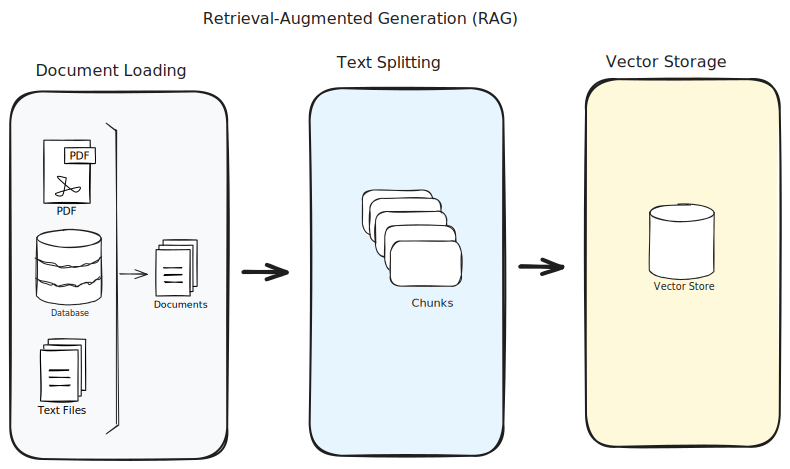

# Retrieval-Augmented Generation (RAG)
Retrieval-Augmented Generation (RAG) enhances the output of Large Language Models (LLMs) by referencing an external 
authoritative knowledge base before generating responses. This method extends LLM capabilities to specific domains 
or internal knowledge without needing to retrain the model, making it a cost-effective way to ensure relevant, 
accurate, and useful output.

## Preparing Data

### Document Loaders
Document loaders are used for loading Documents from a source. A Document is a piece of text and associated metadata.

Document loaders expose a "load" method for loading data as documents from a configured source. They optionally implement a "lazy load" as well for lazily loading data into memory.

### Text Splitters
A document needs to be transformed before they are fed to a LLM. Transformation may include **splitting** a long document
into smaller chunks can help fit them into your model's **context window**.

Preferably, chunks should be **semantically related**. The meaning of semantics depends on context. It can be sentences,
special tags, etc.

#### LLM Context Windows
A Large Language Model (LLM) **context window** refers to the amount of text (measured in tokens or words) that the 
model can consider at once while generating a response. The context window is crucial for optimizing the
performance of LLMs. The key points of context window are the followings:

 - **Size**: The context window size typically depends on the architecture and configuration of the LLM. 
For example, some models might have a context window of 512 tokens, while others might go up to 2048 tokens or more.

 - **Tokens**: A token can be as small as one character or as large as one word, depending on the tokenization method 
used by the model.

 - **Impact**: The larger the context window, the more information the model can utilize to generate a coherent and 
contextually relevant response. However, larger context windows also require more computational resources.

 - **Use Case**: In practical applications, the context window size affects how much of the previous conversation or 
text can be considered. For instance, in a chat application, it determines how many previous messages the model can 
reference to generate a relevant reply.

## Vector Stores
A vector store is a specialized database designed to store and manage high-dimensional vectors, 
which are often used in machine learning and artificial intelligence applications. They are primarily used to handle 
the storage and retrieval of vector representations of data, such as embeddings generated by LLMs.